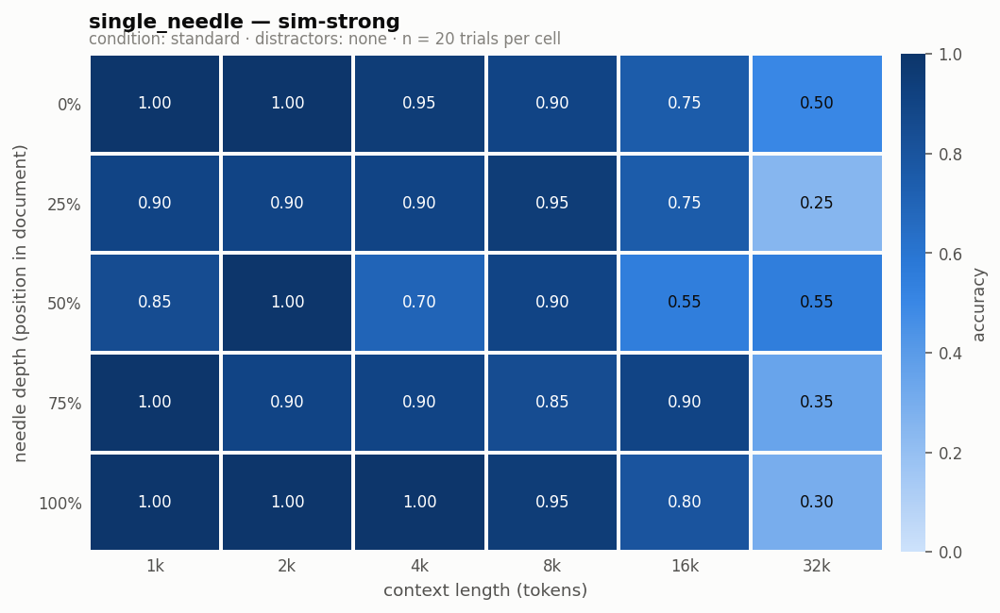
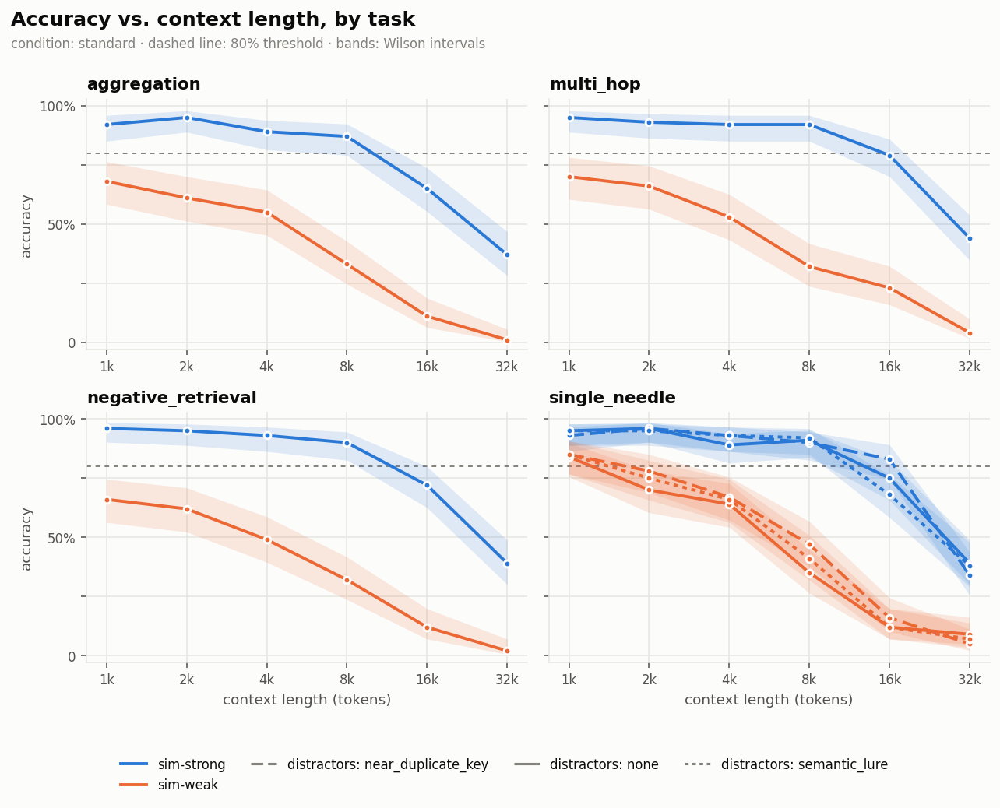
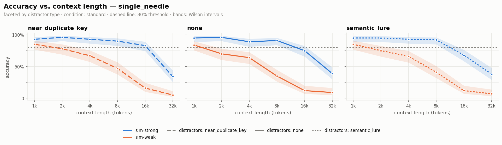
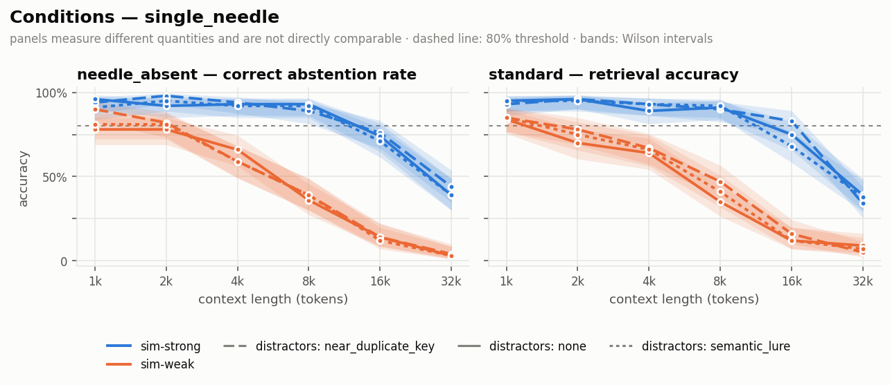

# parallax-long-context

Long-context evaluation for custom attention mechanisms.

This repository pairs the **Parallax** reference kernels with **`lctx-bench`**, an
evaluation harness built here from scratch that measures how model accuracy
degrades as context length and information position vary — with confidence
intervals, explicit control conditions, and a first-class plug-in path for a
swapped attention implementation.

| Directory | What it is |
|---|---|
| **`lctx-bench/`** | The evaluation harness. All of the work described below. |
| `_upstream/` | Vendored [Parallax](https://github.com/Yifei-Zuo/Parallax) reference implementation — Parameterized Local Linear Attention, with Triton, Helion, and CuTeDSL kernels. |

The motivating question: *when you replace softmax attention with something else,
what does it cost you in long-range recall?* Benchmarks that answer this need to
be trusted more than they need to be large, so `lctx-bench` is built around a
small number of invariants that are enforced by tests rather than asserted in a
README.

```bash
cd lctx-bench
pip install -e '.[dev,tiktoken]'
lctx smoke          # full pipeline offline in ~30s: no network, no API key, no GPU
```

---

## What it measures

Each trial buries randomly generated facts (*needles*) in neutral filler (*the
haystack*), asks a question only those facts can answer, and scores the answer
deterministically. Sweeping context length and needle depth produces an accuracy
surface. The headline number is **effective context length**: the longest context
at which a model still clears an accuracy bar — with the bar applied to the
*lower confidence bound*, not the point estimate.

### Accuracy across length × depth

The signature view. Rows are needle depth (top = start of document), columns are
context length, each cell is accuracy over independent seeds.



### Accuracy vs. length, with confidence bands

Color is model identity, dash pattern is distractor type, and the shaded band is
the 95% Wilson interval — which is what makes a dip readable as a real effect
rather than noise.



### Distractor ablation

The same task under three kinds of interference: clean, keys one or two
characters off the real one, and semantic lures that match every surface cue
while being about a different relation.



### Control conditions

Each panel measures a *different quantity*, so they are plotted separately rather
than pooled into one misleading curve: `standard` is retrieval accuracy,
`needle_absent` is the rate of correctly abstaining when the evidence has been
removed.



### The headline table

Figures show shape; the CSV shows what that shape rests on. `effective_context`
is the longest context where the *lower* confidence bound still clears the bar —
`strict` requires every shorter length to clear it too, `max` does not, so when
they differ the curve is non-monotonic and the report says so instead of hiding it.

```
effective context length (lower CI bound >= threshold):
  model            task                condition       distractors            strict       max
  sim-strong       aggregation         needle_absent   none                     1000      8000
  sim-strong       aggregation         standard        none                     4000      4000
  sim-strong       multi_hop           standard        none                     8000      8000
  sim-strong       negative_retrieval  standard        none                     8000      8000
  sim-strong       single_needle       standard        none                     8000      8000
  sim-strong       single_needle       standard        near_duplicate_key       8000      8000
  sim-weak         single_needle       standard        none                     1000      1000
  sim-weak         multi_hop           standard        none                        —         —
  sim-weak         aggregation         standard        none                        —         —
```

### It polices itself

Every report leads with integrity warnings, before any numbers. This one fired
on its own showcase run:

```
! ceiling for sim-weak/aggregation is only 75% with no haystack at all —
  degradation at length cannot be attributed to context length until the
  ceiling is high
```

Others cover token-tolerance violations, errored trials, and under-powered grids
— the last matters more than it looks, since a Wilson lower bound is strict
enough that a *perfect* cell needs n ≥ 16 pooled trials before it can clear an
0.8 bar at all.

> The figures and table above come from `lctx-bench/configs/showcase.yaml`
> (14,640 trials, ~7 min, 0 errors), which runs against **simulators, not
> language models** — they show what the harness produces, not how any real model
> performs. Reproduce with `lctx run -c configs/showcase.yaml`.

---

## What was implemented

| Component | Contents |
|---|---|
| **Tasks** (7) | `single_needle`, `multi_needle`, `multi_hop`, `aggregation`, `selective_copy`, `ordering`, `negative_retrieval` — each with a generator, a solver oracle, and a scorer |
| **Distractors** (4) | `none`, `near_duplicate_key`, `semantic_lure`, `repeated_decoy` |
| **Haystack** | Neutral prose filler + random-token ablation; token-exact packing that solves for filler length against the fully rendered request |
| **Adapters** | `anthropic`, `openai` (covers any OpenAI-compatible server via `base_url`), `hf`, `custom_attn`, plus offline simulators — or any `package.module:callable` |
| **Scoring** | `exact_match`, `set_f1`, `numeric_tol`, `absent_detection`, and an LLM judge that ships with its own agreement validation |
| **Runner** | Async grid sweep, rate limiting, retry with backoff, per-trial checkpointing and exact resume, cost and latency logging |
| **Statistics** | Wilson intervals for accuracy, deterministic bootstrap for continuous scores, effective-context estimation (strict and max readings) |
| **Reporting** | Heatmaps, curve families, seven CSV tables, a machine-readable `summary.json`, and integrity warnings |
| **Probes** | Optional per-layer attention sink mass, normalized entropy, and needle attention mass |
| **Tests** | 361 tests, fully offline, ~25s |

---

## The invariants

These are the load-bearing claims. Each is enforced by a test.

1. **Length is decoupled from difficulty.** Growing the context adds filler and
   nothing else — a generator never sees `target_tokens` as an input to content.
   The same seed produces byte-identical needles, questions, and answers at 1k
   tokens and at 1M.

2. **Zero parametric leakage.** Every key, value, and identifier is drawn fresh
   per trial from an arbitrary symbol alphabet. Nothing is answerable from
   pretraining, nothing is reused between trials, and the filler is checked to
   never contain the answer.

3. **Length is measured in tokens, with the model's own tokenizer, including
   chat-template overhead.** Tokenization is not additive across concatenation
   boundaries, so the packer measures real rendered messages rather than summing
   parts. Every cell lands within one token of target.

4. **Every cell reports an interval.** Wilson for accuracy — the normal
   approximation misbehaves exactly where long-context evaluation lives, at small
   n and proportions near 0 and 1 — and a deterministic bootstrap for continuous
   scores.

5. **Controls are part of the design.** The no-haystack ceiling runs by default;
   a degradation curve is uninterpretable until the ceiling is high, and the
   report says so when it isn't. Shuffled-haystack and needle-absent controls are
   available per task.

6. **Deterministic and reproducible.** Greedy decoding by default. Config, seeds,
   git commit, adapter identity, prompt hashes, raw outputs, tokens, latency, and
   cost are all persisted, and prompts regenerate byte-identically from
   `(task, seed, length, depth, condition)` alone.

`lctx validate -c <config>` reports a grid's statistical power before you spend
anything on it.

---

## Evaluating a custom attention implementation

This is what the harness exists for. The useful comparison is **the same weights
loaded two ways**, so any difference in the curves is attributable to the
mechanism — `configs/local_custom_attention.yaml` is set up exactly that way.

Three plug-in routes, in increasing order of invasiveness:

```yaml
params:
  # Route 1 — register a kernel and select it by name (preferred for kernel swaps)
  register_hook: mypkg.attn:register
  attn_implementation: my_attn

  # Route 2 — module surgery, when the mechanism changes structure
  # attention_patch: mypkg.attn:patch_model
  # patch_kwargs: {window: 512}

  # Route 3 — a complete loader, when it is not an AutoModelForCausalLM
  # model_loader: mypkg.loading:load_my_model
```

`examples/custom_attention_stub.py` is a runnable reference showing all three,
with a self-check that verifies shapes, normalization, causality, and that the
mechanism actually changed the attention pattern — before you spend a sweep on
it. The harness records which route fired and whether the patch applied into
`manifest.json`, because a run that reports "custom attention" while having
silently measured the stock model is the failure this guards against.

---

## Further reading

**[`lctx-bench/README.md`](lctx-bench/README.md)** has the full documentation:
the task table, scoring and judge validation, output formats, how to add a model
or a task, the probe suite, and an honest list of known limitations.
